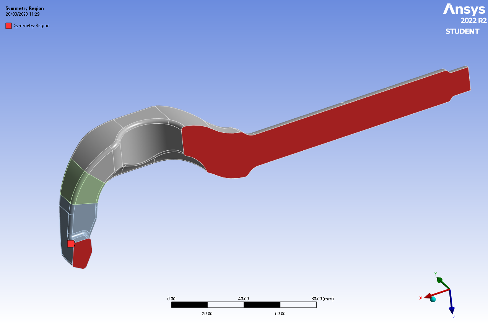
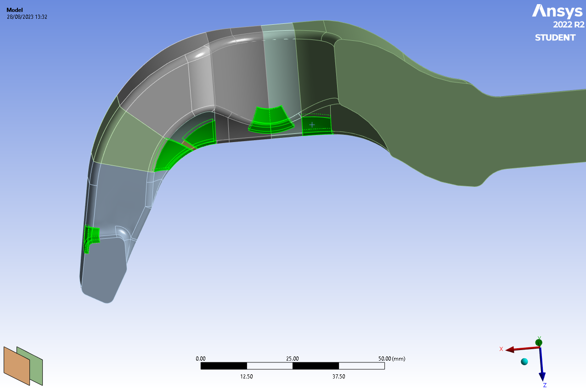
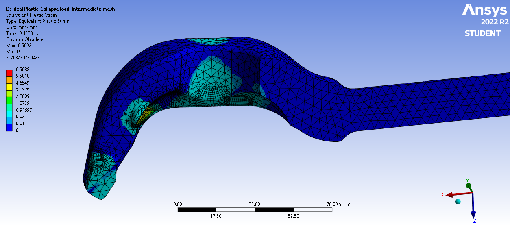

# RATCHET_TENSIONER

**Abstract** 

Problem Statement: 

It has to be justified if the analysed system is able to withstand the operating load condition under different circumstances and the desired safety factors for static strength and fatigue strength has to be fulfilled. Static and fatigue strength assessment has to be done for all load cases. 

Apprehension 

Analysed system: 

**Spindle hade of ratchet tensioner ICE CURT-SL 10** 

Load cases: 

|Case |Loading Type |Magnitude |
| - | - | - |
|Pretension load |Tensile load |28 KN (x-axis) |
|Lashing load |Tensile load |100 KN (x-axis) |

Modus Operandi 

The analysis is done using Finite-Element-Method via ANSYS Workbench 2022 R2. The Static and the fatigue strength assessment are done using FKM-Guideline 7th edition.  

Results  

- Maximum stress calculated for the lashing load case from the linear elastic model is beyond the yield limit of the chosen material.  
- Static strength assessment for pretension load and lashing load resulted the combined degree of utilization of 20% and 90% respectively. 
- Fatigue strength assessment of the system for the pretension load resulted in an infinite load cycle with a maximum of 50% of the combined degree of utilization. 
- The fatigue strength assessment of the lashing load determined that the part could withstand 1600 full load cycles.   

Contents 

1. **Introduction** 
1. **System** 
1. **Part lists** 
1. **Environment** 
1. **Structural loading**
1. **Method of analysis** 
1. **Software used.** 
1. **Coordinate system**
4. **Analysis of the ratchet tensioner Head** 
1. **Geometry simplification** 
1. **Boundary condition**  
1. **Meshing** 
1. **Stress analysis of pretension load**
1. **Stress analysis of the lashing load**  
1. **Material selection**
1. **Collapse load simulation**  
1. **Static strength assessment pretension load and Lashing load.** 
1. **Fatigue strength assessment pretension and lashing load.** 
5. **Conclusion** 

List of Tables 

Table 1: Part list and Material assignment. \
Table 2: Force on load case.\
Table 3: List of maximum stress from pretension load and their percentage of convergence.\
Table 4: Maximum, Middle and Minimum Principal Stress of the stress hotspots by pretension.\
Table 5: List of maximum stress from lashing load and their percentage of convergence. \
Table 6: Maximum, Middle and Minimum Principal Stress of the stress hotspots by lashing. \
Table 7: List of available materials and their degree of utilization according to the maximum stress obtained on stress analysis.\
Table 8: Material data used for Ideal-plastic simulation.\ 
Table 9: Assumption and values for static assessment. \
Table 10: Combined degree of utilization of the stress hotspots by pretension load. \
Table 11: Combined degree of utilization of the stress hotspots by lashing load. \
Table 12: Maximum, Middle and Minimum Principal Stress of the stress hotspot and its normal point at 0.5 mm distance by pretension load.\
Table 13: Maximum, Middle and Minimum Principal Stress of the stress hotspot and its normal point at 0.5 mm distance by Lashing load. \
Table 14: Fatigue strength assessment of pretension load. \
Table 15: Fatigue strength assessment of the lashing load case. 

List of Figures 

Figure 1: An example of lashing chin combination \
Figure 2: CAD model of head of the ratchet tensioner \
Figure 3: Used coordinate system. \
Figure 4: Half model of the system with symmetry region. \
Figure 5: Remote Displacement on the hub and shaft contact face. \
Figure 6: Remote force application face. \
Figure 7: Initial meshing with spots of interest. \
Figure 8: Initial element mesh quality. \
Figure 9: Sweepable bodies on the high stress region.\
Figure 10: Intermediate mesh \
Figure 11: Quality of intermediate mesh. \
Figure 12: Intermediate mesh on the high stress regions. \
Figure 13: Quality of the Intermediate mesh of high stress region \
Figure 14: Final Mesh \
Figure 15: Element Quality of final mesh \
Figure 16: Final mesh on the high stress regions. \
Figure 17: Element quality of final mesh on the high stress regions. \
Figure 18: Averaged Maximum stress for Intermediate mesh. \
Figure 19: Unaveraged Maximum stress for Intermediate mesh. \
Figure 20: Averaged Maximum stress for final mesh. \
Figure 21:Unaveraged Maximum stress for final mesh. \
Figure 22: Named selection of stress hot spots. \
Figure 23: Stress triads of Hsp\_Spot\_1 (left) and stress triads of Hsp\_Spot\_2 (right). \
Figure 24: Stress triads of Hsp\_Spot\_3 (left) and stress triads of Hsp\_Spot\_4(right). \
Figure 25: Stress triads of Hsp\_Spot\_4. \
Figure 26: Onset of yielding of the system.\
Figure 27: Collapse load of the system. \
Figure 28: Plastic Strain during collapse of the system. \
Figure 29: Paths normal to the surface of stress hotspots.  \
Figure 30: Vector principal stress on the Path\_normal from Hsp\_Spot\_1(left) and Path\_normal from Hsp\_Spot\_2(right) \
Figure 31: Vector principal stress on the Path\_normal from Hsp\_Spot\_3(left) and Path\_normal from Hsp\_Spot\_4(right). \
Figure 32: Vector principal stress on the Path\_normal from Hsp\_Spot\_5. 

## 1. Introduction  

In logistics and cargo transportation ensuring the safety and security of the goods is essential. One crucial aspect of the process is effective application of the securing elements. Figure 1. shows a combination of lashing chain systems. These elements are used to maintain load stability during transportation, especially considering the dynamic forces that occur during the process.  

*Figure 1: An example of lashing chin combination*

Ratchet tensioners are shortening device that is used for applying pretension in the lashing process. The pretension force is applied at the lever of the tensioner, which will ensure the stability of the arrangement to apply additional force due to lashing.  

This study focuses on the selection for material of the head of the tensioner. This part is responsible for transmitting force from the chain to the tensioner. The strength of such a unit is limited by the tensile strength of the same unit. The geometry of the hardware that is analysed is shown in the figure below.    

*Figure 2: CAD model of head of the ratchet tensioner*

## 2. System 

The system is a single part which can be characterized as the head of the ratchet tensioner. However, chains are inserted in the slot of the head, which are means of the force application on the head. As shown in Figure 1, a threaded hub holds two identical heads which are then connected to the chains and a lever to apply a pretension. 

### 2.1 Part lists 

The table below shows the parts that are associated with the system and the materials of the parts. 

*Table 1: Part list and Material assignment.* 

|No. |Part |Material |
| - | - | - |
|1 |Ratchet tensioner head |X5CrNiCuNb 16-4 (P1070) |
|2 |hub |Not specified |
|3 |lever |Not specified |
|4 |Chain |Not specified |

### 2.2 Environment 

The shaft of the head is mounted on the hub and the chain is mounted on the slot of the head. However, the hub and the chains are not part of the system. These parts need not be analysed here, but as it comes to their role in setting the boundary conditions later in the simulation is very important and needs to be considered crucial.  

### 2.3 Structural loading  

Structural loads are the forces that are applied to a structure or a component. During the application only static force is acting in the system which can be characterised as: 

- Pretension load  
- Lashing load 
#### 1. Pretension load

According to EN 192105-3 the Standard Hand Force (SHF) of 500 N is applied at the lever which will generate the Standard Tensioning Force (STF) on the ratchet tensioner. The pretension load for ICE CURT-SL 10 and ICE-VSK-KK-10 are given as 28000 N.  

#### 2. Lashing load 

The Ratchet tensioner head will be loaded with the chain on both heads. Therefore, the orientation of the force will always same. The ratchet tensioner and the chain are designed with a permitted lashing force (LC) of 100000 N. So, our system will be pulled by the force of 100000 N along the axis of the shaft. 

## 3.Method of analysis 
### 3.1 Software used. 

The ANSYS Design Modeler (used for geometry imports and edits), ANSYS Mechanical (used for meshing, boundary setup, solution, and analysis) and ANSYS Workbench 2022 R2 have been used for the analysis of the hardware. 

### 3.2 Coordinate system 

Thepositive x-axis corresponds to the longitudinal axis of the shaft pointing towards the head. The positive z-axis corresponds to the chain inserting axis. The y-axis corresponds to the width of the head. 

*Figure 3: Used coordinate system.* 

## 4. Analysis of the ratchet tensioner Head 

The piece of hardware that needs to be analysed is a single part and does not allow any simplification by breaking down the whole component into different small bodies. Hence, a 3D analysis needs to be performed. Nevertheless, the problem statement can be simplified by using the symmetry planes which results in reducing the model geometry.  

1. Geometry simplification 

The geometry needs to be analysed by considering the load case. Since the load application will be always along the axis of the shaft there is room for further simplification. To make use of the mirror symmetry all the parameters like geometry, load application, and materials must be considered. The part is symmetric along the XZ-plane. Therefore, the load application allows us to make use of the half model. The figure below shows the system after applying the symmetry. 

*Figure 4: Half model of the system with symmetry region.*

2. Boundary condition 

Boundary  conditions  are  usually  assigned  to  specify  the  information  on  the  dependent variable on the domain boundaries. Defining a boundary condition involves identifying the location of the boundaries and supplying adequate reliable information at the boundaries. The following boundary conditions are defined for the analysis of the hardware. 

- Remote Displacement 

This boundary condition defines and allows us also to define the parameters of rotation and displacement at an arbitrary remote location in the space. Due to symmetry rotation along z- axis is set free whereas all other rotational and translational components are set 0. In this system, this boundary condition represents the connection of the shaft with the hub.  

*Figure 5: Remote Displacement on the hub and shaft contact face.*

- Remote Force 

This helps to simplify the problem statement as it allows us to specify the location of load in space from which the force is being generated. In addition, this also allows us to divide the force  into  the  vector  components  for  precision  during  the  analysis.  Because  of  a  half- symmetric model, half of the total force along the x-direction is assigned for each load case. The face that was chosen for the application of the force was considered the contact of the chain with the internal face of the head.  

*Table 2: Force on load case.* 

|Load case |Force (N) |
| - | - |
|Pretension Load |14000 N |
|Lashing Load |64000 N |

*Figure 6: Remote force application face.*

3. Meshing  

The coarse or default meshing of the component enables us to locate the region where the stress is significantly higher. The tetrahedral element of 2 mm is used for the initial meshing. By analysing the simulation with the initial mesh, we were able to determine the region of interest. The figure below shows the initial mesh and the quality of the mesh.  

*Figure 7: Initial meshing with spots of interest.*

*Figure 8: Initial element mesh quality.*

The high-stress spots were identified from the initial mesh. By analysing the different hotspot areas, further refinement of the meshing is done by slicing the body where hexagonal mesh can be created. The figure below shows the regions created in the Design Modular by slicing the main model to ensure the mesh quality on the region of interest. 

*Figure 9: Sweepable bodies on the high stress region.*

With  these  bodies,  we  can  ensure  the  sweep  mesh  on  the  high  stress  regions.  For  the intermediate mesh, a sweep mesh of 1 mm on sweepable bodies and a default mesh of 4 mm on other bodies with growth rate of 1.5 is used. The mesh that was created on those bodies and their mesh quality is illustrated on the figures below.  

*Figure 10: Intermediate mesh* 

*Figure 11: Quality of intermediate mesh.* 

*Figure 12: Intermediate mesh on the high stress regions.* 

*Figure 13: Quality of the Intermediate mesh of high stress region* 

To analyse the FEM mesh convergence this mesh must be refined further. Therefore, as the final mesh, a sweep mesh of 0.5 mm on sweepable bodies and a default mesh of 4 mm on other bodies with a growth rate of 1.5 is used. The mesh that was created on those bodies is their mesh quality are illustrated on the figures below. 

*Figure 14: Final Mesh* 

*Figure 15: Element Quality of final mesh* 

*Figure 16: Final mesh on the high stress regions.* 

*Figure 17: Element quality of final mesh on the high stress regions.* 

4. Stress analysis of pretension load 

Solutions for varying mesh conditions along with their percentage of convergence are listed in the table below. 

*Table 3:List of maximum stress from pretension load and their percentage of convergence.* 

<table><tr><th colspan="1" valign="top">Spots </th><th colspan="1" valign="top">Stress Type </th><th colspan="1" valign="top">Intermediate Mesh </th><th colspan="1" valign="top">Final Mesh </th><th colspan="1">Percentage of Convergence </th></tr>
<tr><td colspan="1" rowspan="2">1 </td><td colspan="1">Maximum stress Averaged (MPa) </td><td colspan="1" valign="top">390.02 </td><td colspan="1" valign="top">434.63 </td><td colspan="1" valign="top">11.44% </td></tr>
<tr><td colspan="1">Maximum stress Unaveraged (MPa) </td><td colspan="1" valign="top">390.56 </td><td colspan="1" valign="top">434.99 </td><td colspan="1" valign="top">11.37% </td></tr>
<tr><td colspan="1" rowspan="2">2 </td><td colspan="1">Maximum stress Averaged (MPa) </td><td colspan="1" valign="top">364.16 </td><td colspan="1" valign="top">374.59 </td><td colspan="1" valign="top">2.86% </td></tr>
<tr><td colspan="1">Maximum stress Unaveraged (MPa) </td><td colspan="1" valign="top">372.04 </td><td colspan="1" valign="top">376.38 </td><td colspan="1" valign="top">1.17% </td></tr>
<tr><td colspan="1" rowspan="2">3 </td><td colspan="1">Maximum stress Averaged (MPa) </td><td colspan="1" valign="top">264.86 </td><td colspan="1" valign="top">266.59 </td><td colspan="1" valign="top">0.65% </td></tr>
<tr><td colspan="1">Maximum stress Unaveraged (MPa) </td><td colspan="1" valign="top">265.06 </td><td colspan="1" valign="top">266.61 </td><td colspan="1" valign="top">0.58% </td></tr>
<tr><td colspan="1" rowspan="2">4 </td><td colspan="1">Maximum stress Averaged (MPa) </td><td colspan="1" valign="top">227.35 </td><td colspan="1" valign="top">228.81 </td><td colspan="1" valign="top">0.64% </td></tr>
<tr><td colspan="1">Maximum stress Unaveraged (MPa) </td><td colspan="1" valign="top">228.01 </td><td colspan="1" valign="top">228.84 </td><td colspan="1" valign="top">0.37% </td></tr>
<tr><td colspan="1" rowspan="2">5 </td><td colspan="1">Maximum stress Averaged (MPa) </td><td colspan="1" valign="top">253.23 </td><td colspan="1" valign="top">251.99 </td><td colspan="1" valign="top">-0.49% </td></tr>
<tr><td colspan="1">Maximum stress Unaveraged (MPa) </td><td colspan="1" valign="top">253.56 </td><td colspan="1" valign="top">252.00 </td><td colspan="1" valign="top">-0.62% </td></tr>
</table>

From the table above we can see that all stresses are converged except Spot 1. The reason behind this is the stress singularity due to the force application face. The figure below shows the stress results of the intermediate and final mesh.  

*Figure 18: Averaged Maximum stress for Intermediate mesh.*

*Figure 19: Unaveraged Maximum stress for Intermediate mesh.* 

*Figure 20: Averaged Maximum stress for final mesh.* 

*Figure 21:Unaveraged Maximum stress for final mesh* 

Now for the static assessment, we will need the maximum, middle, and minimum principal stress. Therefore, to get those values it is needed to create  a named selection on those maximum stress points. However, it is necessary to confirm those maximums are coincident with the maximum principal stress. If that is not the case, maximum principal stress on the reason of interest will be the hotspot for the analysis. Let’s verify that the principal stress acting on the hot spots is parallel to the respective surface. The figure below shows the named selection and stress triads of those points.  

*Figure 22: Named selection of stress hot spots.*

*Figure 23: Stress triads of Hsp\_Spot\_1 (left) and stress triads of Hsp\_Spot\_2 (right).* 

*Figure 24: Stress triads of Hsp\_Spot\_3 (left) and stress triads of Hsp\_Spot\_4(right).* 

*Figure 25: Stress triads of Hsp\_Spot\_5.*

Table below show the values that are taken from those hotspots.  

*Table 4: Maximum, Middle and Minimum Principal Stress of the stress hotspots by pretension.* 

|Spots |Mesh points |Maximum Principal Stress (MPa)  |Middle Principal Stress (MPa)  |Minimum Principal Stress (MPa) |
| - | - | :- | :- | :- |
|1 |Hsp\_Spot\_1 |415\.09 |45\.32 |5\.37 |
|2 |Hsp\_Spot\_2 |403\.24 |51\.20 |7\.03 |
|3 |Hsp\_Spot\_3 |273\.72 |15\.44 |0\.19 |
|4 |Hsp\_Spot\_4 |225\.36 |0\.12 |-6.88 |
|5 |Hsp\_Spot\_5 |256\.23 |8\.81 |0\.03 |

5. Stress analysis of the lashing load 

Since the lashing lode is also applied to the same location, we are expecting the stress on that location will be higher on magnitude only. At this point, a lot of differences on the results are not  expected.  Solutions  for  varying  mesh  conditions  along  with  their  percentage  of convergence are listed in the table below. 

*Table 5:List of maximum stress from lashing load and their percentage of convergence.* 

<table><tr><th colspan="1" valign="top">Spots </th><th colspan="1" valign="top">Stress Type </th><th colspan="1" valign="top">Intermediate Mesh </th><th colspan="1" valign="top">Final Mesh </th><th colspan="1">Percentage of Convergence </th></tr>
<tr><td colspan="1" rowspan="2">1 </td><td colspan="1">Maximum stress Averaged (MPa) </td><td colspan="1">1795.55</td><td colspan="1">2010.50</td><td colspan="1">11.97%</td></tr>
<tr><td colspan="1">Maximum stress Unaveraged (MPa) </td><td colspan="1">1798.15</td><td colspan="1">2012.47</td><td colspan="1">11.92%</td></tr>
<tr><td colspan="1" rowspan="2">2 </td><td colspan="1">Maximum stress Averaged (MPa) </td><td colspan="1">1637.69</td><td colspan="1">1674.15</td><td colspan="1">2.23%</td></tr>
<tr><td colspan="1">Maximum stress Unaveraged (MPa) </td><td colspan="1">1672.87</td><td colspan="1">1682.15</td><td colspan="1">0.55%</td></tr>
<tr><td colspan="1" rowspan="2">3 </td><td colspan="1">Maximum stress Averaged (MPa) </td><td colspan="1">1192.18</td><td colspan="1">1194.05</td><td colspan="1">0.16%</td></tr>
<tr><td colspan="1">Maximum stress Unaveraged (MPa) </td><td colspan="1">1193.08</td><td colspan="1">1194.14</td><td colspan="1">0.09%</td></tr>
<tr><td colspan="1" rowspan="2">4 </td><td colspan="1">Maximum stress Averaged (MPa) </td><td colspan="1">1020.50</td><td colspan="1">1020.96</td><td colspan="1">0.05%</td></tr>
<tr><td colspan="1">Maximum stress Unaveraged (MPa) </td><td colspan="1">1023.85</td><td colspan="1">1021.12</td><td colspan="1">-0.27%</td></tr>
<tr><td colspan="1" rowspan="2">5 </td><td colspan="1">Maximum stress Averaged (MPa) </td><td colspan="1">1148.84</td><td colspan="1">1140.06</td><td colspan="1">-0.76%</td></tr>
<tr><td colspan="1">Maximum stress Unaveraged (MPa) </td><td colspan="1">1150.34</td><td colspan="1">1140.17</td><td colspan="1">-0.88%</td></tr>
</table>

Now like the stress analysis of pretension load, we will need the maximum, middle, and minimum  principal  stress.  Analysing  the  vector principal  stress  on  these  hotspots  it  was evident that the vector remains unchanged. Moreover, only the magnitude of stress triads changed in this lode case. Therefore, only the values are presented below. 

*Table 6:Maximum, Middle and Minimum Principal Stress of the stress hotspots by lashing.* 

|Spots |Mesh points |Maximum Principal Stress (MPa)  |Middle Principal Stress (MPa)  |Minimum Principal Stress (MPa) |
| - | - | :- | :- | :- |
|1 |Hsp\_Spot\_1 |1910\.25|202\.20|27\.50|
|2 |Hsp\_Spot\_2 |1789\.94|226\.54|23\.56|
|3 |Hsp\_Spot\_3 |1016\.76|68\.08|0\.81|
|4 |Hsp\_Spot\_4 |1225\.52|0\.46|-2.89|
|5 |Hsp\_Spot\_5 |1158\.57|39\.81|-0.41|

6. Material selection  

The Maximum equivalent stress obtained from the linear elastic model are initial determining factor in the process of material selection. In this process, a theoretical degree of utilization is calculated. Which will be considered in choosing the material. The equation below shows the calculation of the theoretical degree of utilization.  

$ a_{SK}= { \sigma_v \over \sigma_{SK}/j_{jes}} \leq 1$

$\sigma_{SK}= R_p \cdot n_{pl}$

$$ n_{pl} = min({K_p;\sqrt {E \cdot \varepsilon_{ertr}/R_p}})$$

$ where,$ 

$a_{SK} : degree \space of \space utilization$

$\sigma_v : equvalent\space von\space Moesis\space stress$

$\sigma_{SK} : static\space component\space strength$

$j_{jes} : total\space safety \space factor$

$R_p : Yeld \space strength $

$n_{pl}: (plastic)\space section\space factor)$

$K_p = plastic\space notch\space factor$

$\sqrt{E\cdot {\varepsilon_{ertr}\over R_p}} : critical\space strain\space criterion$

$\varepsilon_{ertr} : A; \space i.e.\space enlongation\space to\space break\space for\space ductile\space material$
⁡

In our case, the materials that should be considered are provided. These materials theoretical degree of utilization is calculated with the maximum von-Miesis stress from the stress analysis and  = 2. The list of materials and their resulting values are provided in the table below.   

*Table 7: List of available materials and their degree of utilization according to the maximum stress obtained on stress analysis.* 

<table><tr><th colspan="1" valign="top">Type </th><th colspan="1" valign="top">Material No. </th><th colspan="1" valign="top">Kind </th><th colspan="1" valign="bottom">(MPa) </th><th colspan="1" valign="bottom">(MPa) </th><th colspan="1" valign="bottom">% </th><th colspan="1"></th><th colspan="1" valign="bottom">(MPa) </th><th colspan="1"></th></tr>
<tr><td colspan="1">X2CrNi12 </td><td colspan="1">1.4003 </td><td colspan="1">P(25) </td><td colspan="1">450 </td><td colspan="1">250 </td><td colspan="1">18 </td><td colspan="1">12.30 </td><td colspan="1">3074 </td><td colspan="1">1.31 </td></tr>
<tr><td colspan="1">X6CrA113 </td><td colspan="1">1.4002 </td><td colspan="1">H(13.5 </td><td colspan="1">400 </td><td colspan="1">210 </td><td colspan="1">17 </td><td colspan="1">13.04 </td><td colspan="1">2738 </td><td colspan="1">1.47 </td></tr>
<tr><td colspan="1" rowspan="2" valign="top">X6Cr17 </td><td colspan="1" rowspan="2" valign="top">1.4016 </td><td colspan="1">H(13.5) </td><td colspan="1">430 </td><td colspan="1">240 </td><td colspan="1">18 </td><td colspan="1">12.55 </td><td colspan="1">3012 </td><td colspan="1">1.34 </td></tr>
<tr><td colspan="1">P(25) </td><td colspan="1">430 </td><td colspan="1">240 </td><td colspan="1">20 </td><td colspan="1">13.23 </td><td colspan="1">3175 </td><td colspan="1">1.27 </td></tr>
<tr><td colspan="1">X6CrM017-1 </td><td colspan="1">1.41 13 </td><td colspan="1">C(8 ) </td><td colspan="1">450 </td><td colspan="1">260 </td><td colspan="1">18 </td><td colspan="1">12.06 </td><td colspan="1">3135 </td><td colspan="1">1.28 </td></tr>
<tr><td colspan="1">X6CrNi17-1 </td><td colspan="1">1.4017 </td><td colspan="1">C(8) </td><td colspan="1">500 </td><td colspan="1">330 </td><td colspan="1">12 </td><td colspan="1">8.74 </td><td colspan="1">2884 </td><td colspan="1">1.40 </td></tr>
<tr><td colspan="1">X2CrTiNb18 </td><td colspan="1">1.4509 </td><td colspan="1">C(8) </td><td colspan="1">430 </td><td colspan="1">230 </td><td colspan="1">18 </td><td colspan="1">12.82 </td><td colspan="1">2949 </td><td colspan="1">1.37 </td></tr>
<tr><td colspan="1" rowspan="2" valign="top">X20Cr13 </td><td colspan="1" rowspan="2" valign="top">1.4021 </td><td colspan="1">QT650 </td><td colspan="1">650 </td><td colspan="1">450 </td><td colspan="1">12 </td><td colspan="1">7.48 </td><td colspan="1">3367 </td><td colspan="1">1.20 </td></tr>
<tr><td colspan="1">QT750 </td><td colspan="1">750 </td><td colspan="1">550 </td><td colspan="1">10 </td><td colspan="1">6.18 </td><td colspan="1">3399 </td><td colspan="1">1.18 </td></tr>
<tr><td colspan="1">X4CrNiM016-5-1 </td><td colspan="1">1.4418 </td><td colspan="1">T840 </td><td colspan="1">840 </td><td colspan="1">660 </td><td colspan="1">14 </td><td colspan="1">6.67 </td><td colspan="1">4405 </td><td colspan="1">0.91 </td></tr>
<tr><td colspan="1" rowspan="3" valign="top">X5CrNiCuNb16-4 </td><td colspan="1" rowspan="3" valign="top">1.4542 </td><td colspan="1">P1070 </td><td colspan="1">1070 </td><td colspan="1">1000 </td><td colspan="1">8 </td><td colspan="1">4.10 </td><td colspan="1">4099 </td><td colspan="1">0.98 </td></tr>
<tr><td colspan="1">P950 </td><td colspan="1">950 </td><td colspan="1">800 </td><td colspan="1">10 </td><td colspan="1">5.12 </td><td colspan="1">4099 </td><td colspan="1">0.98 </td></tr>
<tr><td colspan="1">P850 </td><td colspan="1">850 </td><td colspan="1">600 </td><td colspan="1">12 </td><td colspan="1">6.48 </td><td colspan="1">3888 </td><td colspan="1">1.04 </td></tr>
<tr><td colspan="1">X10CrNi18-8 </td><td colspan="1">1.431 </td><td colspan="1">C(8) </td><td colspan="1">600 </td><td colspan="1">250 </td><td colspan="1">40 </td><td colspan="1">18.33 </td><td colspan="1">4583 </td><td colspan="1">0.88 </td></tr>
<tr><td colspan="1">X2CrNiN18-10 </td><td colspan="1">1.4311 </td><td colspan="1">P(75) </td><td colspan="1">550 </td><td colspan="1">270 </td><td colspan="1">40 </td><td colspan="1">17.64 </td><td colspan="1">4762 </td><td colspan="1">0.85 </td></tr>
<tr><td colspan="1">X5CrNi18-10 </td><td colspan="1">1.4301 </td><td colspan="1">P(75) </td><td colspan="1">520 </td><td colspan="1">210 </td><td colspan="1">45 </td><td colspan="1">21.21 </td><td colspan="1">4455 </td><td colspan="1">0.90 </td></tr>
<tr><td colspan="1">X6CrNiTi18-10 </td><td colspan="1">1.4541 </td><td colspan="1">P(75) </td><td colspan="1">500 </td><td colspan="1">200 </td><td colspan="1">40 </td><td colspan="1">20.49 </td><td colspan="1">4099 </td><td colspan="1">0.98 </td></tr>
<tr><td colspan="1">X6CrNiMoTi17-12-2 </td><td colspan="1">1.4571 </td><td colspan="1">P(75) </td><td colspan="1">520 </td><td colspan="1">220 </td><td colspan="1">40 </td><td colspan="1">19.54 </td><td colspan="1">4299 </td><td colspan="1">0.94 </td></tr>
<tr><td colspan="1">X2CrNiMoN17-13-5 </td><td colspan="1">1.4439 </td><td colspan="1">P(75) </td><td colspan="1">580 </td><td colspan="1">270 </td><td colspan="1">40 </td><td colspan="1">17.64 </td><td colspan="1">4762 </td><td colspan="1">0.85 </td></tr>
<tr><td colspan="1">XINiCrMoCuN25-20-7 </td><td colspan="1">1.4529 </td><td colspan="1">P 75) </td><td colspan="1">650 </td><td colspan="1">300 </td><td colspan="1">40 </td><td colspan="1">16.73 </td><td colspan="1">5020 </td><td colspan="1">0.80 </td></tr>
<tr><td colspan="1">X2CrNiN23-4 </td><td colspan="1">1.4362 </td><td colspan="1">P 75) </td><td colspan="1">630 </td><td colspan="1">400 </td><td colspan="1">25 </td><td colspan="1">11.46 </td><td colspan="1">4583 </td><td colspan="1">0.88 </td></tr>
<tr><td colspan="1">X2CrNiMoN25-7-4 </td><td colspan="1">1.441 </td><td colspan="1">P(75) </td><td colspan="1">730 </td><td colspan="1">530 </td><td colspan="1">20 </td><td colspan="1">8.90 </td><td colspan="1">4718 </td><td colspan="1">0.85 </td></tr>
<tr><td colspan="1">X2CrNi12 </td><td colspan="1">1.4003 </td><td colspan="1">P(25) </td><td colspan="1">450 </td><td colspan="1">250 </td><td colspan="1">18 </td><td colspan="1">12.30 </td><td colspan="1">3074 </td><td colspan="1">1.31 </td></tr>
</table>

According to the table above we can choose the materials that are in green zone. However, they are the theoretical values with the elongation to break is considered while calculating the critical strain criterion. In this simulation initially, X4CrNiM016-5-1 material was chosen for the analysis. Which did fail on the static strength assessment. Those results are not included in this report. Nevertheless, in process of finding bater solution X5CrNiCuNb16-4 (P1070) was chosen. Which has the higher tensile strength and yield strength.  

7. Collapse load simulation 

For the plastic simulation, bilinear isotropic hardening along with linear elastic behaviour is used. Youngs modulus and poison’s ratio is taken from the data sheet of the material. The materials data are that are used during the simulation. 

*Table 8: Material data used for Ideal-plastic simulation.* 

|Material Type |X5CrNiCuNb 16-4 |
| - | - |
|Material Number |1\.4542 |
|Kind of product |P1070 (Hot rolled sheet)  |
|Tensile strength |1070 MPa |
|Yield strength |1000 MPa |
|Elongation at rupture |8% |
|Tangent modulus |200 MPa |

In this simulation to find the collapse load five times the combination of the pretension load and the lashing load was applied. since it was not necessary to have a finer mesh to get the collapse load, in this simulation the intermediate mesh model is used. The following figures show the onset of yielding, the collapse load, and the failure of the component.  

*Figure 26: Onset of yielding of the system.* 

*Figure 27: Collapse load of the system.* 

*Figure 28: Plastic Strain during collapse of the system* 

From the above figures, the onset of yielding takes place when the time instance to 0.136 s 

and rupture takes place when the time instances to 0.458 s. In this instance the plastic strain 

reaches the full cross-section of the body. This simulation gives us the plastic notch factor of 3.368.  

8. Static strength assessment pretension load and Lashing load. 

Now all the values that are needed for the static assessment are obtained. Therefore, we can proceed with  the  assessment.  The  following  assumptions  and  values  were  considered  during  the  static assessment. 

*Table 9: Assumption and values for static assessment.* 

|S.N. |Title |Value  |
| - | - | - |
|1 |Bending at reference point |No |
|2 |Stresses longitudinal to direction pf processing |Yes |
|3 |Heat treatable steel |yes |
|4 |Surface treatment |No  |
|5 |Plastic limit load |0\.458 |
|6 |Elastic limit load |0\.136 |
|7 |Consequence of failure  |High |
|8 |Probability of occurrence of stress |High  |

With these values and assumptions, we are ready for the static assessment of the system. Static strength assessment with local stress from the FKM guideline is available in the Excel sheet format. In this report, only the results are presented. The tables below show the combined degree of utilization of our system from pretension load and lashing load. 

*Table 10: Combined degree of utilization of the stress hotspots by pretension load.* 

|Spots |Mesh points |Maximum Principal Stress (MPa)  |Middle Principal Stress (MPa)  |Minimum Principal Stress (MPa) |combined degree of utilization|
| - | - | :- | :- | :- | - |
|1 |Hsp\_Spot\_1 |415\.09 |45\.32 |5\.37 |0\.217 |
|2 |Hsp\_Spot\_2 |403\.24 |51\.20 |7\.03 |0\.209 |
|3 |Hsp\_Spot\_3 |273\.72 |15\.44 |0\.19 |0\.148 |
|4 |Hsp\_Spot\_4 |225\.36 |0\.12 |-6.88 |0\.127 |
|5 |Hsp\_Spot\_5 |256\.23 |8\.81 |0\.03 |0\.140 |

*Table 11:Combined degree of utilization of the stress hotspots by lashing load.* 

|Spots |Mesh points |Maximum Principal Stress (MPa)  |Middle Principal Stress (MPa)  |Minimum Principal Stress (MPa) |combined degree of utilization|
| - | - | :- | :- | :- | - |
|1 |Hsp\_Spot\_1 |1910\.25|202\.20|27\.50|0\.978 |
|2 |Hsp\_Spot\_2 |1789\.94|226\.54|23\.56|0\.909 |
|3 |Hsp\_Spot\_3 |1016\.76|68\.08|0\.81|0\.546 |
|4 |Hsp\_Spot\_4 |1225\.52|0\.46|-2.89|0\.681 |
|5 |Hsp\_Spot\_5 |1158\.57|39\.81|-0.41|0\.628 |

9. Fatigue strength assessment pretension and lashing load. 

Static strength assessment proved that the material that was chosen for our system is for the given loading scenario. Nevertheless, it is still to be determined that the life of the system is adequate for the operation. To do so a fatigue strength assessment is necessary. FKM-Guideline provides us with a process of the fatigue strength assessment with local stress. The equation below represents the fatigue strength assessment with local stress from FKM guidelines. 

- **Final assessment** 

 

$$a_{BK,\sigma_i} = {\sigma_{a,i} \over {\sigma_{BK}/j_D}} \leq 1$$

$a_{BK,\sigma_i} :⁡principal \space ⁡stresses  \space \sigma_⁡1 >  \sigma_⁡2 >  \sigma_⁡3 (s1,s2,s3 in ANSYS) $

$\sigma_{a,i} : ⁡amplitude \space  ⁡of \space  ⁡principal \space  ⁡stresses$

$\sigma_{BK} : ⁡component⁡ \space  fatigue \space  ⁡strength $

$j_D : ⁡total  \space ⁡factor \space  ⁡of \space  ⁡safety \space  ⁡for \space  fatigue $

- **Factor of safety** 

$$j_D = j_S \cdot j_F$$

⁡$j_S: ⁡load \space ⁡factor \space ⁡of \space ⁡safety⁡(safe \space ⁡load \space ⁡assumptions⁡⁡=⁡1)$ 

$j_F:⁡material⁡ \space factor \space ⁡of \space safety⁡(indeed \space ⁡more \space ⁡like \space ⁡risk \space ⁡assessment)$ 

⁡= ⁡=

- **Component Strength** 

$$\sigma_{BK} = \sigma_{AK} \cdot K_{BK,\sigma}$$

⁡$\sigma_{AK}:component \space ⁡fatigue \space ⁡limit$

$ K_{BK,\sigma}: variable \space ⁡amplitude \space ⁡fatigue \space⁡ strength \space ⁡factor$

$$K_{BK,\sigma} = {({N_D \over N})^{1 \over k}}$$

⁡$N_D :knee \space ⁡point⁡ \space of \space ⁡S-N \space ⁡curve⁡=⁡10^6 \space ⁡cycles$

$N ⁡ ⁡:required \space ⁡number \space ⁡of \space ⁡cycles⁡$
$k ⁡: ⁡slope \space ⁡of \space ⁡S-N \space ⁡curve⁡=⁡5 $

- **Component Strength Fully Reversed** 
$$\sigma_{AK} = \sigma_{WK} \cdot K_{AK,\sigma}$$

⁡$\sigma_{AK}:⁡Component \space ⁡fatigue⁡ \space limit \space ⁡for \space ⁡fully \space ⁡reversed⁡ \space stress \space ⁡R⁡=⁡-1$ 

⁡$K_{AK,\sigma} : ⁡mean \space ⁡stress \space ⁡factor $

$M_\sigma = a_m \cdot 10^-3 \cdot {R_m \over MPa}+b_m :⁡mean \space ⁡stress \space ⁡sensitivity $

$$ \sigma_{WK} = {\sigma_{w,zd} \over K_{WK} }$$

$\sigma_{w,zd}: ⁡fatigue \space ⁡limit⁡ \space from \space ⁡material \space ⁡testing \space ⁡for \space ⁡R⁡=⁡-1,⁡p⁡=⁡97.5\% $

$K_{WK} : design \space ⁡factor $

- **Design factor** 

$$K_{WK,\sigma} = {1\over n_\sigma}[1+{1\over 2}({1\over K_R})]\cdot {1 \over K_v}$$

$n_\sigma :⁡fatigue⁡ \space support⁡ \space effect \space ⁡due \space ⁡to \space ⁡stress \space ⁡gradient⁡ $

$K_t:⁡(static)⁡stress \space ⁡concentration \space ⁡factor \space ⁡of \space ⁡notch⁡ $

⁡$K_f:⁡fatigue \space ⁡effect⁡ \space factor \space ⁡of \space ⁡notch⁡$

⁡$K_R:⁡factor \space ⁡for \space ⁡fatigue \space ⁡effect \space ⁡of \space ⁡surface \space ⁡roughness$

⁡$K_V:⁡factor⁡ \space for \space ⁡fatigue \space ⁡effect \space ⁡of \space ⁡surface \space ⁡treatment,⁡e.g.,⁡hardening$ 

- **Design factor** 
$$ n_\sigma = K_t - K_{f-ratio}$$

$$ \hat G ⁡= {d\sigma /ds \over \sigma} :⁡related \space ⁡stress \space ⁡gradient $$

Now with substituting all in initial equation: 

$$ a_{BK,\sigma_i} ={\sigma{a,i}\over \sigma_{w,zd}} {{{1\over n_\sigma}[1+{1\over 2}({1\over K_R})]\cdot {1 \over K_v}}\over K_{AK,\sigma} \cdot K_{BK,\sigma}/j_D} \leq 1  $$

Above equation incorporates the fatigue support and the surface hardening. In this approach, we can either use fatigue support or surface hardening factor. Both of these factors improve the fatigue life of the component. However, in our assessment, we have not considered surface treatment (i.e.,  = 1). Additionally, the fatigue support is calculated with the stress gradient at the local stress hotspot. For this assessment stress gradient at the local stress hotspots is required. To obtain these values, at each local stress hotspot a local coordinate system is created  whose  z-axis  is  normal  (pointing  inside)  to  the  surface.  With  the  help  of  those coordinate systems, 0.5 mm long path construction geometry along the z-axis is created. Which allows us to evaluate the principal stress on those construction geometries. Moreover, we will only need the stress at the end point of those paths. The figure below shows the paths that were created to analyse the stress gradient at the hotspots. 

*Figure 29: Paths normal to the surface of stress hotspots.* 

*Figure 30: Vector principal stress on the Path\_normal from Hsp\_Spot\_1(left) and Path\_normal from Hsp\_Spot\_2(right)* 

*Figure 31: Vector principal stress on the Path\_normal from Hsp\_Spot\_3(left) and Path\_normal from Hsp\_Spot\_4(right).* 

*Figure 32: Vector principal stress on the Path\_normal from Hsp\_Spot\_5* 

Resulting evaluation of those stress are presented on the table below.     

*Table 12: Maximum, Middle and Minimum Principal Stress of the stress hotspot and its normal point at 0.5 mm distance by pretension load.* 

<table><tr><th colspan="1" valign="top">Spots</th><th colspan="1" valign="top">Mesh points</th><th colspan="1" valign="top">Maximum Principal Stress (MPa)</th><th colspan="1" valign="top">Middle Principal Stress (MPa)</th><th colspan="1" valign="top">Minimum Principal Stress (MPa)</th></tr>
<tr><td colspan="1" rowspan="2" valign="top">1 </td><td colspan="1" valign="top">Hsp_Spot_1</td><td colspan="1" valign="top">410.67 </td><td colspan="1" valign="top">42.52 </td><td colspan="1" valign="top">0.12 </td></tr>
<tr><td colspan="1" valign="top">Hsp_Spot_1_Normal</td><td colspan="1" valign="top">259.29 </td><td colspan="1" valign="top">37.87 </td><td colspan="1" valign="top">8.948 </td></tr>
<tr><td colspan="1" rowspan="2" valign="top">2 </td><td colspan="1" valign="top">Hsp_Spot_2</td><td colspan="1" valign="top">403.24 </td><td colspan="1" valign="top">50.55 </td><td colspan="1" valign="top">7.03 </td></tr>
<tr><td colspan="1" valign="top">Hsp_Spot__2_Normal</td><td colspan="1" valign="top">260.19 </td><td colspan="1" valign="top">47.7 </td><td colspan="1" valign="top">23.67 </td></tr>
<tr><td colspan="1" rowspan="2" valign="top">3 </td><td colspan="1" valign="top">Hsp_Spot_3</td><td colspan="1" valign="top">273.67 </td><td colspan="1" valign="top">15.43 </td><td colspan="1" valign="top">0.18 </td></tr>
<tr><td colspan="1" valign="top">Hsp_Spot_3_Normal</td><td colspan="1" valign="top">249.23 </td><td colspan="1" valign="top">12.4 </td><td colspan="1" valign="top">5.725 </td></tr>
<tr><td colspan="1" rowspan="2" valign="top">4 </td><td colspan="1" valign="top">Hsp_Spot_4</td><td colspan="1" valign="top">225.33 </td><td colspan="1" valign="top">0.1 </td><td colspan="1" valign="top">-6.88 </td></tr>
<tr><td colspan="1" valign="top">Hsp_Spot_4_Normal</td><td colspan="1" valign="top">209.07 </td><td colspan="1" valign="top">3.95 </td><td colspan="1" valign="top">-9.7 </td></tr>
<tr><td colspan="1" rowspan="2" valign="top">5 </td><td colspan="1" valign="top">Hsp_Spot_5</td><td colspan="1" valign="top">256.30 </td><td colspan="1" valign="top">8.81 </td><td colspan="1" valign="top">0.03 </td></tr>
<tr><td colspan="1" valign="top">Hsp_Spot_5_Normal</td><td colspan="1" valign="top">237.19 </td><td colspan="1" valign="top">9.07 </td><td colspan="1" valign="top">3.77 </td></tr>
</table>

*Table 13: Maximum, Middle and Minimum Principal Stress of the stress hotspot and its normal point at 0.5 mm distance by Lashing load.* 

<table><tr><th colspan="1" valign="top">Spots</th><th colspan="1" valign="top">Mesh points</th><th colspan="1" valign="top">Maximum Principal Stress (MPa)</th><th colspan="1" valign="top">Middle Principal Stress (MPa)</th><th colspan="1" valign="top">Minimum Principal Stress (MPa)</th></tr>
<tr><td colspan="1" rowspan="2" valign="top">1 </td><td colspan="1" valign="top">Hsp_Spot_1</td><td colspan="1" valign="top">1877.40 </td><td colspan="1" valign="top">194.39 </td><td colspan="1" valign="top">0.61 </td></tr>
<tr><td colspan="1" valign="top">Hsp_Spot_1_Normal</td><td colspan="1" valign="top">1185.40 </td><td colspan="1" valign="top">17314 </td><td colspan="1" valign="top">40.91 </td></tr>
<tr><td colspan="1" rowspan="2" valign="top">2 </td><td colspan="1" valign="top">Hsp_Spot_2</td><td colspan="1" valign="top">1843.40 </td><td colspan="1" valign="top">231.09 </td><td colspan="1" valign="top">32.16 </td></tr>
<tr><td colspan="1" valign="top">Hsp_Spot__2_Normal</td><td colspan="1" valign="top">1189.50 </td><td colspan="1" valign="top">218.01 </td><td colspan="1" valign="top">108.05 </td></tr>
<tr><td colspan="1" rowspan="2" valign="top">3 </td><td colspan="1" valign="top">Hsp_Spot_3</td><td colspan="1" valign="top">1251.10 </td><td colspan="1" valign="top">70.54 </td><td colspan="1" valign="top">0.81 </td></tr>
<tr><td colspan="1" valign="top">Hsp_Spot_3_Normal</td><td colspan="1" valign="top">1139.40 </td><td colspan="1" valign="top">55.04 </td><td colspan="1" valign="top">26.17 </td></tr>
<tr><td colspan="1" rowspan="2" valign="top">4 </td><td colspan="1" valign="top">Hsp_Spot_4</td><td colspan="1" valign="top">1030.10 </td><td colspan="1" valign="top">0.48 </td><td colspan="1" valign="top">-31.47 </td></tr>
<tr><td colspan="1" valign="top">Hsp_Spot_4_Normal</td><td colspan="1" valign="top">955.75 </td><td colspan="1" valign="top">18.07 </td><td colspan="1" valign="top">-44.62 </td></tr>
<tr><td colspan="1" rowspan="2" valign="top">5 </td><td colspan="1" valign="top">Hsp_Spot_5</td><td colspan="1" valign="top">1171.70 </td><td colspan="1" valign="top">40.29 </td><td colspan="1" valign="top">0.14 </td></tr>
<tr><td colspan="1" valign="top">Hsp_Spot_5_Normal</td><td colspan="1" valign="top">1084.30 </td><td colspan="1" valign="top">41.47 </td><td colspan="1" valign="top">17.22 </td></tr>
</table>

With the obtained values in tables 12 and 13, we are ready for the fatigue strength assessment of the system according to the FKM-Guideline. As mentioned before, we have the equations and calculation scheme available in Excel format. Following results are obtained with the  = 1.5⁡ and the surface roughness of 16µm. The table below shows the result of the fatigue strength  analysis  of  the  pretension  load.  The  pretension  load  is  an  ideal  pulsating  load. Therefore, the lower load stress or the minimum stress is zero. 

*Table 14: Fatigue strength assessment of pretension load.* 

<table><tr><th colspan="1" rowspan="2" valign="top">Spots</th><th colspan="1" rowspan="2" valign="top">Mesh points</th><th colspan="1" rowspan="2" valign="top">Distance of neighbouring point (mm)</th><th colspan="2">Stress amplitude at neighbouring point </th><th colspan="1" rowspan="1" valign="top">No of load cycle </th><th colspan="1" rowspan="2" valign="top">combined degree of utilization </th></tr>
<tr><td colspan="1">Maximum Principal Stress (MPa) </td><td colspan="1">Middle Principal Stress (MPa) </td></tr>
<tr><td colspan="1" valign="top">1</td><td colspan="1" valign="top">Hsp_Spot_1</td><td colspan="1" valign="top">0.5 </td><td colspan="1" valign="top">129.645 </td><td colspan="1" valign="top">18.93 </td><td colspan="1" valign="top">100000 </td><td colspan="1" valign="top">0.548 </td></tr>
<tr><td colspan="1" valign="top">2</td><td colspan="1" valign="top">Hsp_Spot_2</td><td colspan="1" valign="top">0.5 </td><td colspan="1" valign="top">130.09 </td><td colspan="1" valign="top">23.85 </td><td colspan="1" valign="top">100000 </td><td colspan="1" valign="top">0.527 </td></tr>
<tr><td colspan="1" valign="top">3</td><td colspan="1" valign="top">Hsp_Spot_3</td><td colspan="1" valign="top">0.5 </td><td colspan="1" valign="top">124.6 </td><td colspan="1" valign="top">6.2 </td><td colspan="1" valign="top">100000 </td><td colspan="1" valign="top">0.396 </td></tr>
<tr><td colspan="1" valign="top">4</td><td colspan="1" valign="top">Hsp_Spot_4</td><td colspan="1" valign="top">0.5 </td><td colspan="1" valign="top">104.53 </td><td colspan="1" valign="top">1.97 </td><td colspan="1" valign="top">100000 </td><td colspan="1" valign="top">0.343 </td></tr>
<tr><td colspan="1" valign="top">5</td><td colspan="1" valign="top">Hsp_Spot_5</td><td colspan="1" valign="top">0.5 </td><td colspan="1" valign="top">118.85 </td><td colspan="1" valign="top">4.5 </td><td colspan="1" valign="top">100000 </td><td colspan="1" valign="top">0.377 </td></tr>
</table>

Similarly, in the lashing load case, the application load is a pulsating load. However, the pretension load will always be present during the operation. Therefore, the lower load stress should be equal to the stress from the pretension load. With that consideration fatigue strength assessment of the lashing load case was conducted. The table below shows the resulting stress amplitude at the neighbouring point, no of load cycle, and combined degree of utilization. 

*Table 15: Fatigue strength assessment of the lashing load case.* 

<table><tr><th colspan="1" rowspan="2" valign="top">Spots</th><th colspan="1" rowspan="2" valign="top">Mesh points</th><th colspan="1" rowspan="2" valign="top">Distance of neighbouring point (mm) </th><th colspan="2">Stress amplitude at neighbouring point </th><th colspan="1" rowspan="1" valign="top">No of load cycle </th><th colspan="1" rowspan="2" valign="top">combined degree of utilization </th></tr>
<tr><td colspan="1">Maximum Principal Stress (MPa)</td><td colspan="1">Middle Principal Stress (MPa)</td></tr>
<tr><td colspan="1" valign="top">1</td><td colspan="1" valign="top">Hsp_Spot_1</td><td colspan="1" valign="top">0.5 </td><td colspan="1" valign="top">722.3 </td><td colspan="1" valign="top">105.5 </td><td colspan="1" valign="top">1600 </td><td colspan="1" valign="top">1.000 </td></tr>
<tr><td colspan="1" valign="top">2</td><td colspan="1" valign="top">Hsp_Spot_2</td><td colspan="1" valign="top">0.5 </td><td colspan="1" valign="top">724.8 </td><td colspan="1" valign="top">132.9 </td><td colspan="1" valign="top">1600 </td><td colspan="1" valign="top">0.982 </td></tr>
<tr><td colspan="1" valign="top">3</td><td colspan="1" valign="top">Hsp_Spot_3</td><td colspan="1" valign="top">0.5 </td><td colspan="1" valign="top">649.3 </td><td colspan="1" valign="top">33.7 </td><td colspan="1" valign="top">1600 </td><td colspan="1" valign="top">0.615 </td></tr>
<tr><td colspan="1" valign="top">4</td><td colspan="1" valign="top">Hsp_Spot_4</td><td colspan="1" valign="top">0.5 </td><td colspan="1" valign="top">582.4 </td><td colspan="1" valign="top">11 </td><td colspan="1" valign="top">1600 </td><td colspan="1" valign="top">0.512 </td></tr>
<tr><td colspan="1" valign="top">5</td><td colspan="1" valign="top">Hsp_Spot_5</td><td colspan="1" valign="top">0.5 </td><td colspan="1" valign="top">660.7 </td><td colspan="1" valign="top">25.3 </td><td colspan="1" valign="top">1600 </td><td colspan="1" valign="top">0.573 </td></tr>
</table>

5. Conclusion  

In the material selection process of the spindle hade ICE CURT-SL 10, the maximum stress calculated for the lashing load case from the linear elastic model is beyond the yield limit of the chosen material. However, calculating the static strength component of the material calculated  with  the  critical  strain  criterion  allowed  us  to  see  the  theoretical  degree  of utilization  of  the  material  available.  Considering  those  factors  initially,  X4CrNiM016-5-1 material was chosen for the analysis. Which did fail on the static strength assessment. Those results are not included in this report. Nevertheless, in the process of finding a better solution X5CrNiCuNb16-4  (P1070)  was  chosen.  Which  has  the  higher  tensile  strength  and  yield strength.   

The static strength assessment according to FKM guidelines resulted in the static degree of utilization for the pretension load and lashing load at the converged mesh area of 20% and 90%  respectively.  Additionally,  the  fatigue  strength  assessment  of  the  system  for  the pretension load resulted in the infinite lode cycle with a maximum of 50% of the combined degree of utilization. However, for the lashing load case, those values were significantly low. The fatigue strength assessment of the lashing load determined that the part could withstand 1600 full load cycles.   

Reference  

1. Analytical strength assessment of components in Mechanical Engineering: made of Steel, Cast Iron and Aluminium Materials; [RFN-07-20-EN], 2020. 7th, revised edition. Frankfurt am Main: VDMA Verlag GmbH. ISBN 978-3-8163-0745-7 
1. Lashing chains in quality grade 12-ICE user instruction accessed at 08/08/2023 [https://www2.rud.com/PHP/php/ecs/web_live/ECS_OBJBAUM_MED/ECS_9294_37.pdf ](https://www2.rud.com/PHP/php/ecs/web_live/ECS_OBJBAUM_MED/ECS_9294_37.pdf)

